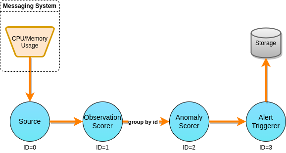

# Machine Outlier (MO)

Command line arguments:

* --help (-h): show help message and quit
* --rate (-r): tuple generation rate (0 means unlimited generation rate)
* --sampling (-s): tuple latency sampling rate (0 means to sample every tuple)
* --parallelism (-p): operator parallelism degrees, separated by commas.
* --batch (b): output batch sizes for each operator, separated by commas (0
  means that batching is disabled).
* --chaining (-c): whether to use chaining.
* --duration (-d): duration in seconds.
* --outputdir (-o): directory to output metric information.
* --execmode (-e): execution mode to be used (DEFAULT, DETERMINISTIC...)
* --timepolicy (-t): time policy to be used.
* --file (-f): observation input file.
* --parser (-P): observation parser to be used.
* --anomalyscorer (-a): Anomaly Scorer to be used (Sliding Window, Data
  Stream...)
* --alerttriggerer (-g): Alert Triggerer to be used (Default, Top-K...)

Operator indices (starting from 0):

* Source: 0
* Observation Scorer: 1
* Anomaly Scorer: 2
* Alert Triggerer: 3

