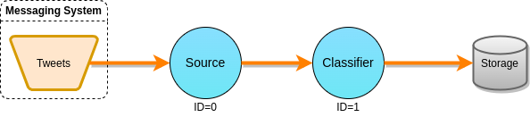

# Sentiment Analysis (SA)

Command line arguments:

* --help (-h): show help message and quit
* --rate (-r): tuple generation rate (0 means unlimited generation rate)
* --sampling (-s): tuple latency sampling rate (0 means to sample every tuple)
* --batch (b): output batch sizes for each operator, separated by commas (0
means that batching is disabled).
* --chaining (-c): whether to use chaining.
* --duration (-d): duration in seconds.
* --outputdir (-o): directory to output metric information.
* --execmode (-e): execution mode to be used (DEFAULT, DETERMINISTIC...)
* --timepolicy (-t): time policy to be used.

Operator indices (starting from 0):

* Source: 0
* Classifier: 1
* Sink: 2

