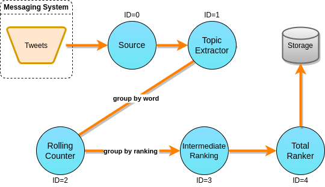

# Trending Topics (TT)

Command line arguments:

* --help (-h): show help message and quit
* --rate (-r): tuple generation rate (0 means unlimited generation rate)
* --sampling (-s): tuple latency sampling rate (0 means to sample every tuple)
* --parallelism (-p): operator parallelism degrees, separated by commas.
* --batch (b): output batch sizes for each operator, separated by commas (0
means that batching is disabled).
* --chaining (-c): whether to use chaining.
* --duration (-d): duration in seconds.
* --outputdir (-o): directory to output metric information.
* --execmode (-e): execution mode to be used (DEFAULT, DETERMINISTIC...)
* --timepolicy (-t): time policy to be used.
* --timernodes (-T): choose whether to use tick tuple sources (if they are not
  used, timers are implemented using internal threads)

Operator indices (starting from 0):

* Source: 0
* Topic Extractor: 1
* Rolling Counter: 2
* Intermediate Ranker: 3
* Total Ranker: 4
* Sink: 5

